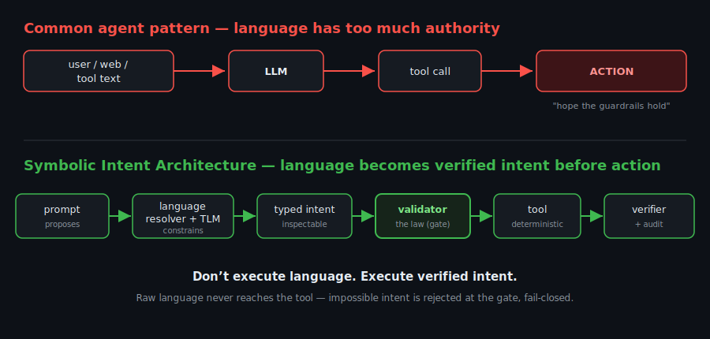

# PassGen

[](https://github.com/wyckit/PassGen/actions/workflows/ci.yml)
[](LICENSE)
[](https://dotnet.microsoft.com/)

> **Don't execute language. Execute verified intent.**

**PassGen looks like a password generator. It is really a small architecture demo.**

Modern AI agents can call tools, write code, query databases, send messages, and trigger
workflows. That power creates a safety problem: **raw language is not a reliable authority
layer.** A convincing sentence — from a user, a web page, a retrieved document, or another
tool's output — should not be able to *directly* cause an action.

PassGen demonstrates a different pattern, **Symbolic Intent Architecture (SIA)**:

> language proposes → symbols constrain → deterministic tools execute → verifiers audit

The demo domain is password generation because it is small, security-sensitive, and easy to
understand. There is no LLM, no API call, no cloud — the "understanding" lives in a compiled
knowledge graph, generation is a deterministic engine, and **every result is verified against
the request.**

---

## The shift



```
  Common agent pattern  ─  language has too much authority
  user / web / tool text ──► LLM ──► tool call ──► action          ("hope the guardrails hold")


  Symbolic Intent Architecture  ─  language becomes inspectable intent before action
  prompt ──► language resolver ──► symbolic graph ──► typed intent ──► validator ──► tool ──► verifier ──► audit
            (proposes)            (constrains)        (inspectable)    (law)         (machine) (inspector) (history)
```

Raw language never reaches the tool. It must become typed, validated structure first — and if
that structure is impossible or disallowed, the tool is never invoked. Read the full pattern in
**[docs/SYMBOLIC-INTENT-ARCHITECTURE.md](docs/SYMBOLIC-INTENT-ARCHITECTURE.md)**.

## See it: the pipeline, made visible

`passgen --trace` renders all five stages so you can watch language turn into verified intent:

```
$ passgen --trace "give me a 20-character password with 3 numbers, 2 symbols, no confusing characters"

  +-- [1] PROMPT  (what the human said)
  |     "give me a 20-character password with 3 numbers, 2 symbols, no confusing characters"
  v
  +-- [2] RESOLVED INTENT  (language -> inspectable symbolic constraints)
  |     length        = 20
  |     numeric       = min 3
  |     symbol        = min 2
  |     exclude       = ambiguous look-alikes (0 O o 1 l I)
  v
  +-- [3] VALIDATION  (is the intent satisfiable?)
  |     satisfiable   = YES
  v
  +-- [4] EXECUTION  (deterministic tool runs on validated intent)
  |     rng           = CSPRNG (cryptographically secure)
  |     output        = ^&Z!5n76^2^^E_RS3qn4
  v
  +-- [5] VERIFICATION  (post-conditions checked after execution)
        length: pass   numeric: pass (>=3)   symbol: pass (>=2)   verdict: MATCHES REQUEST
```

The revealing case is the **impossible** one — fail-closed:

```
$ passgen --trace "make me a 4-character password with 10 uppercase letters"

  +-- [3] VALIDATION     satisfiable = NO    status = REJECTED
  +-- [4] EXECUTION      [ HALTED ] the generator is never invoked
  +-- [5] VERIFICATION   [ BYPASSED ] nothing was produced to verify
```

Language proposed something impossible. The symbolic layer refused it **before** any tool ran.
The system is not trying to be agreeable — it is trying to be correct.

> 🎬 Render this as a GIF with [`vhs docs/demo.tape`](docs/demo.tape).

## Quick start

```powershell
.\passgen.ps1                                                       # interactive assistant
.\passgen.ps1 give me a 16 char password, 2 uppercase, no ambiguous # one-shot
.\passgen.ps1 --trace 20 chars, 3 digits, 2 symbols, no ambiguous   # show the SIA pipeline
.\passgen.ps1 what reduces password entropy                         # knowledge Q&A
```

```
password: ktQ_+EVq8?Zy7GbK
  spec:    len=16, allow: uppercase(min2)+lowercase+numeric+symbol, no-ambiguous
  entropy: 97.7 bits (very strong), charset 69, avg crack ~4.0e9 years
  check:   OK -- satisfies the spec
```

## The symbolic layer: "the TLM is the model"

PassGen's symbolic layer is a **TLM** (a compiled concept/relation knowledge graph). The
vocabulary and grammar are not hard-coded — they live in the TLM data:

- **`rs-char-classes`** holds class aliases (`digits`/`numbers`/`numeric` → numeric, …).
- **`rs-nl-vocabulary`** holds NL *cues* — each a `Trigger` phrase + a `Signal` (e.g. `q.min`,
  `target.length`, `only.<csv>`, `unsupported:<reason>`).
- **`TlmNlu`** loads those cues and aliases at startup and builds its matchers *from* them.
  **Coverage grows by editing TLM data, not code** (see the learning loop in the SIA doc).

Generation is deterministic and auditable: CSPRNG by default (unbiased rejection sampling), a
seeded generator only when you pass an explicit seed (flagged INSECURE), flat-uniform fill,
minimums satisfied first, every result re-checked, and entropy reported as the exact
`log2(valid count)`.

## Documentation

| Doc | What |
|-----|------|
| [docs/SYMBOLIC-INTENT-ARCHITECTURE.md](docs/SYMBOLIC-INTENT-ARCHITECTURE.md) | the paradigm, the analogy, how it generalizes (SQL/workflows/DevOps), where LLMs fit |
| [THREAT_MODEL.md](THREAT_MODEL.md) | STRIDE + how SIA neutralizes prompt injection / MCP tool risk |
| [SECURITY.md](SECURITY.md) | security policy + design stance |
| [docs/ARCHITECTURE.md](docs/ARCHITECTURE.md) | PassGen implementation internals |
| [docs/NLU-MATRIX.md](docs/NLU-MATRIX.md) | 50+ phrasings normalizing to identical symbolic shapes |
| [docs/GOAL-symbolic-intent-architecture.md](docs/GOAL-symbolic-intent-architecture.md) | the north-star goal prompt |

## Layout

| Path | Purpose |
|------|---------|
| `PassGen.App/` | the assistant: REPL + one-shot + `--trace`, English → password + knowledge Q&A (no LLM) |
| `PassGen.Engine/` | deterministic engine — spec, generator, validator, entropy, `RandomStringTool`, and `TlmNlu` (the TLM-driven resolver) |
| `PassGen.Tlm/` | self-contained TLM format library — compiler/decompiler, SHA-256 hasher, `.tlmz` envelope (**byte-compatible with live RSRM**) |
| `PassGen.Tlm.Cli/` | the `tlm` CLI: `author` / `compile` / `decompile` / `validate` / `verify` |
| `PassGen.Engine.Tests/` | xUnit suite — targeted cases + a coverage matrix generated from the TLM vocabulary |
| `dataset/` | the standalone RSRM TLM dataset (7 linked TLMs); see [dataset/README.md](dataset/README.md) |

## Build / test / run

```bash
dotnet test PassGen.Engine.Tests           # full suite, net10.0
dotnet run  --project PassGen.Engine.Demo  # demo output + the tool schema
.\build-dataset.ps1                        # author -> compile -> decompile -> verify the TLMs
.\make-publish.ps1                         # assemble a self-contained publish/ bundle
```

> **Heads-up:** a running `passgen` (REPL or `passgen.exe`) locks the build DLLs. Exit any
> session before building or publishing.

## Conventions

net10.0 · nullable + implicit usings · file-scoped namespaces · `sealed record` + primary
constructors for contracts · xUnit. `.ps1` scripts are kept ASCII-only.

## License

[MIT](LICENSE).
